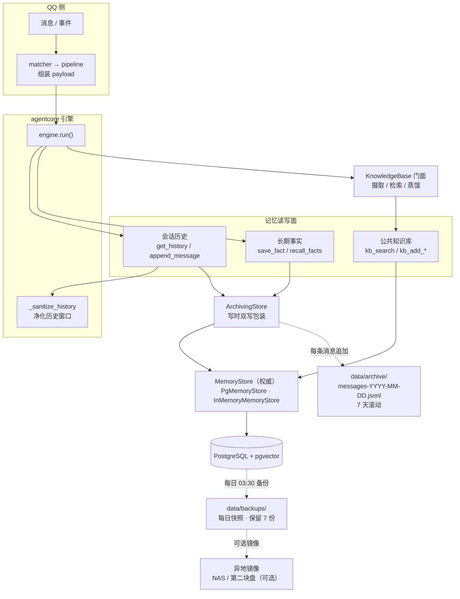
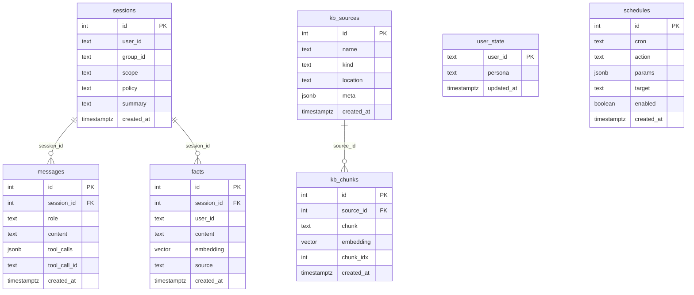
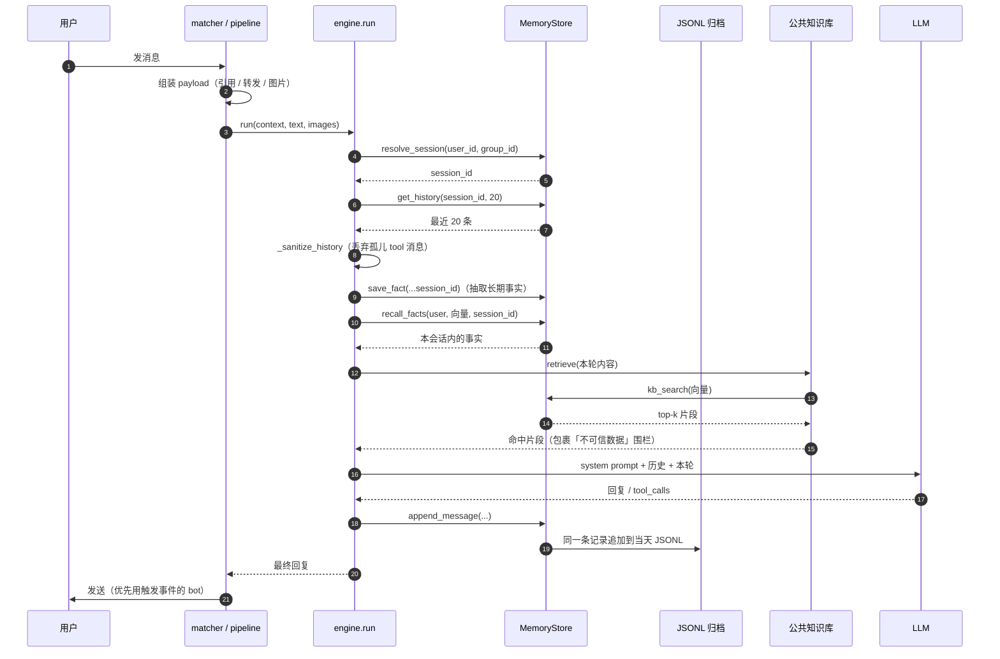
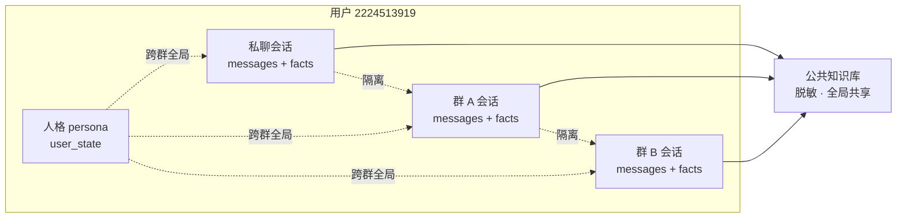
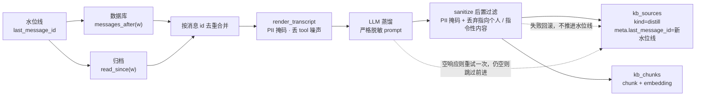
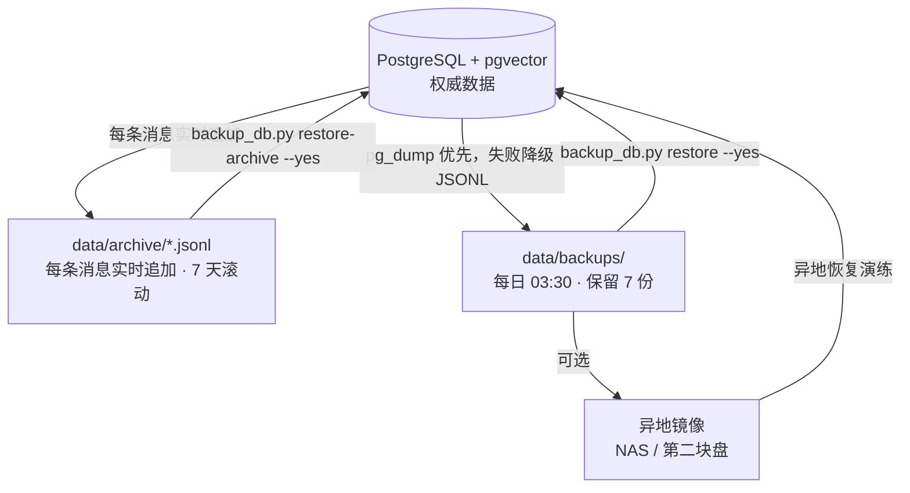
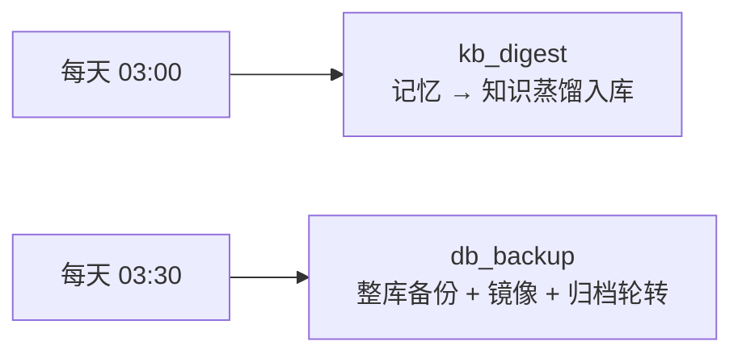

# agent-demo 记忆存储结构

> **一句话**：会话与事实按「用户 × 会话（群/私聊）」隔离，公共知识库全局脱敏共享；
> 数据同时落在三处——PostgreSQL（权威）、JSONL 归档（实时日志）、每日备份（快照）。

---

## 1. 总体架构

---

## 2. PostgreSQL 表关系

### 关键索引

| 索引 | 表 | 作用 |
|---|---|---|
| `sessions_user_scope_key` (UNIQUE) | sessions | `(user_id, COALESCE(group_id,''), scope)`，防并发重复建会话 |
| `messages_session_id_idx` | messages | `(session_id, id)`，历史窗口不再全表扫描 |
| `facts_user_id_idx` | facts | 按用户召回 |
| `facts_embedding_idx` (hnsw) | facts | 向量相似度检索 |
| `kb_chunks_source_id_idx` | kb_chunks | 按来源删除/统计 |
| `kb_chunks_embedding_idx` (hnsw) | kb_chunks | 知识库语义检索 |

> `vector` 的维度 = 启动时探测到的 embedding 模型输出维度（当前 **1024**）。
> 与库中已有列不一致时只告警、不静默改列（避免悄悄清空记忆）。

---

## 3. 一次对话的记忆读写时序

---

## 4. 作用域隔离（易错点）

| 数据 | 键 | 隔离范围 | 说明 |
|---|---|---|---|
| 会话历史 `messages` | `session_id` = （user_id, group_id, scope） | **某人在某群 / 私聊** | 群 A ≠ 群 B ≠ 私聊 |
| 长期事实 `facts` | `user_id` + `session_id` | **跟随会话** | 群 A 说过的事不会召回到群 B；去重也按会话 |
| 人格 `user_state` | `user_id` | **跨群全局** | 有意为之：人格是用户偏好，不是聊天记忆 |
| 公共知识库 `kb_*` | 无（全局） | **所有会话共享** | 入库前脱敏；检索结果按不可信数据围栏 |
| 归档 / 备份 | 无（全局） | **进程外文件** | 与数据库解耦，任何针对库的误操作都碰不到 |

---

## 5. 每日蒸馏流水线（成长型 RAG）

要点：

- 水位线存放在**最后一条 `kind=distill` 的 kb_sources.meta** 里；删除该来源会重置水位线
- 输入是 **数据库 ∪ 归档**：库被清空后知识仍能从归档继续沉淀
- 失败语义：写入失败 → 回滚来源（不推进水位线，下次重试）；LLM 空响应 → 重试一次后**跳过前进**（否则水位线永久卡死）

---

## 6. 三份存储与恢复路径

| 存储 | 位置 | 内容 | 更新频率 | 恢复命令 |
|---|---|---|---|---|
| PG + pgvector | 容器 `agent-demo-db-1` | 会话 / 消息 / 事实 / 知识库 / 人格 | 实时 | — |
| JSONL 归档 | `data/archive/` | 每条消息（含 user_id / group_id / ts） | 逐条追加 | `restore-archive` |
| 备份快照 | `data/backups/` + 镜像 | 整库 | 每日 | `restore --yes` |

> 归档与备份目录都在 `.gitignore` 里（含隐私内容）。
> 归档从**启用时刻**开始记录，更早的历史由数据库备份覆盖。

---

## 7. 后台任务与关键参数

| 配置段 | 参数 | 默认 | 含义 |
|---|---|---|---|
| `agent` | `extract_facts` | `true` | 每轮是否抽取长期事实 |
| `agent` | `memory_facts_top_k` | `5` | 召回事条数 |
| `agent` | `memory_facts_threshold` | `0.15` | 召回相似度下限 |
| `rag` | `top_k` / `threshold` | `4` / `0.3` | 知识库注入条数与下限 |
| `rag` | `chunk_chars` | `600` | 摄取切块长度 |
| `rag` | `digest_cron` | `0 3 * * *` | 蒸馏时间 |
| `rag` | `distill_max_tokens` | `2048` | 蒸馏输出上限（推理模型烧思维链，别调小） |
| `rag` | `min_chars` | `200` | 新内容不足则跳过且**不推进**水位线 |
| `archive` | `keep_days` | `7` | 归档滚动保留天数 |
| `backup` | `keep` / `cron` | `7` / `30 3 * * *` | 备份保留份数与时间 |
| `backup` | `mirror_dir` | 空 | 异地镜像目录（建议填写） |

---

## 8. 已知边界

- `sessions.summary` 字段已建但**从未写入**（滚动摘要未实现）
- `schedules` 表：**用户定时提醒已持久化在这里**（重启不丢）；进程内 cron 任务
  （每日蒸馏/备份）仍由 apscheduler 调度、未落库
- 蒸馏水位线依赖 `kb_sources` 记录，不是独立状态表
- 归档不做回填：启用之前的历史不在归档里
- 单机备份挡得住误删、挡不住盘坏 → 需配置 `AGENT_BACKUP_MIRROR_DIR`
